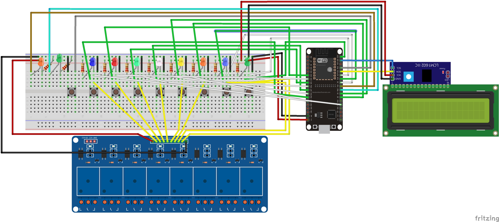
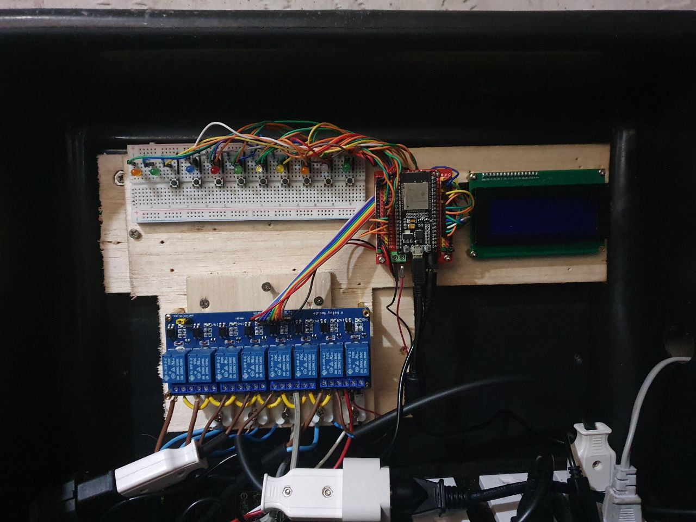

# Arduino Grow System

Automated grow system arduino ide sketches

## Main controller sketch
```
// Network credentials
const char* ssid = "wifi-ssid";
const char* password = "wifi-password";

// MQTT Broker:
const char *mqtt_server = "mqtt-server-address";
const char *mqtt_username = "mqtt-username";
const char *mqtt_password = "mqtt-password";

// System ID
String roomID = "your-system-id";

#include "mainController.h"
```

## Air sensors sketch
```
// Network credentials
const char* ssid = "wifi-ssid";
const char* password = "wifi-password";

// MQTT Broker:
const char *mqtt_server = "mqtt-server-address";
const char *mqtt_username = "mqtt-username";
const char *mqtt_password = "mqtt-password";

// System ID
String roomID = "your-system-id";

#include "airSensors.h"
```

## Services
```
// Restart component
mosquitto_pub -t "{systemID}/{air-sensors|main-controller|water-tester|doser-one|doser-two}-restart" -m "1" -u "user" -P "pass"

// Component screen backlight on/off
mosquitto_pub -t "{systemID}/{air-sensors|main-controller|water-tester}-display-backlight" -m "1|0" -u "user" -P "pass"

// Device network status
mosquitto_sub -t "device-status/{systemID}-{air-sensors|main-controller|water-tester|doser-one|doser-two}" -u "user" -P "pass"

// Update display interval
mosquitto_pub -t "{systemID}/main-controller-display-update-interval" -m "{value}" -u "user" -P "pass"

// Calibrate dosing pumps
mosquitto_pub -t "{systemID}/{doser-one|doser-two}/{p-one-calibrate|p-two-calibrate|p-three-calibrate|p-four-calibrate|p-five-calibrate|p-six-calibrate" -m "{value}" -u "user" -P "pass"
```

## Components list

### Main controller

- 10 led 5mm (2 green, 2 orange, 1 white, 1 light green, 1 light blue, 1 blue, 1 red, 1 yellow)
- 10 resistors(330 ohm more or less)
- breadboard
- 8 push buttons
- 8 channel relay
- lcd with i2c module
- jumper wires
- esp32 chip ( 38 pins)
- esp shield board

## Schematics

### Main controller



## Final parts example

