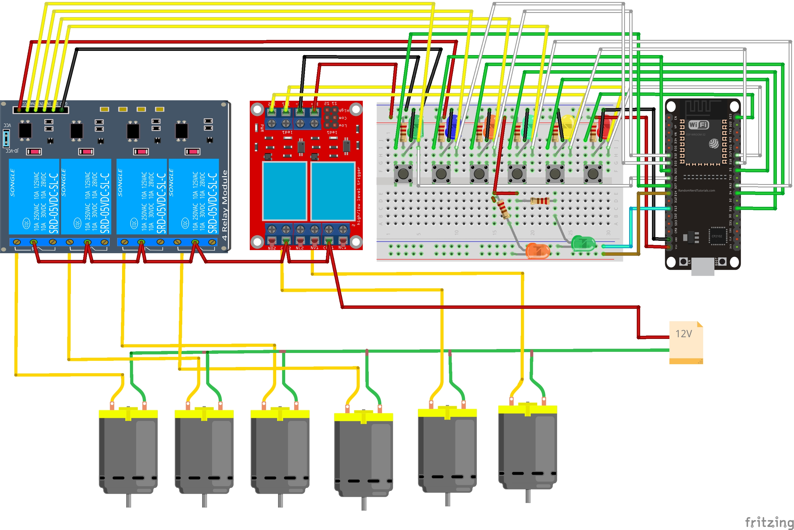
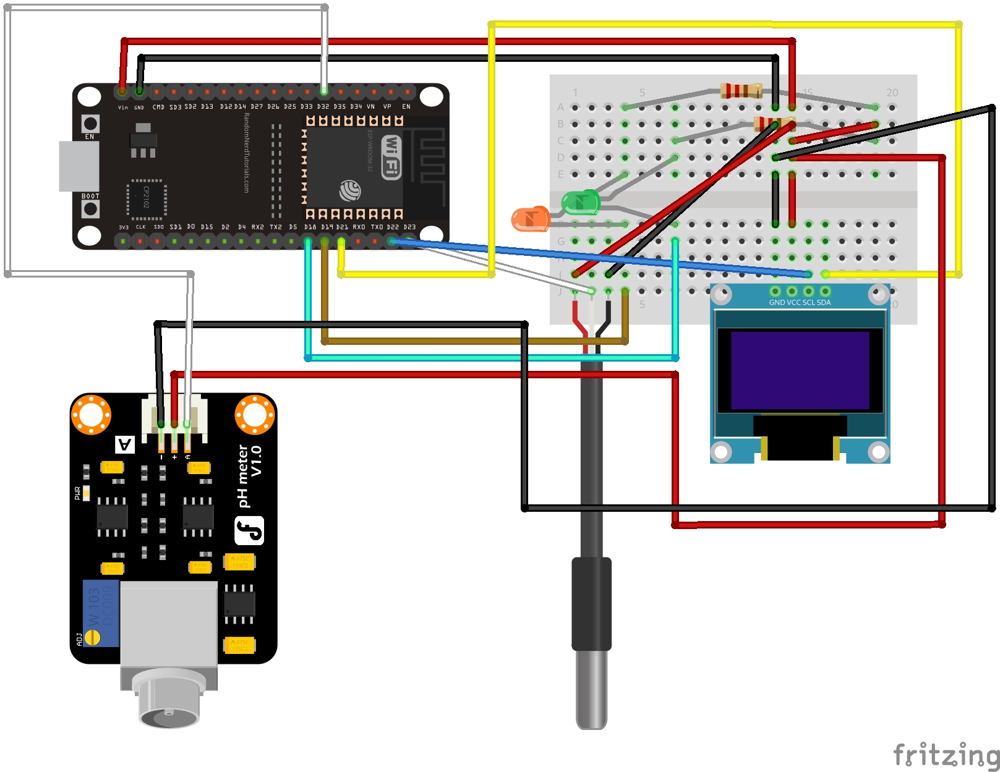
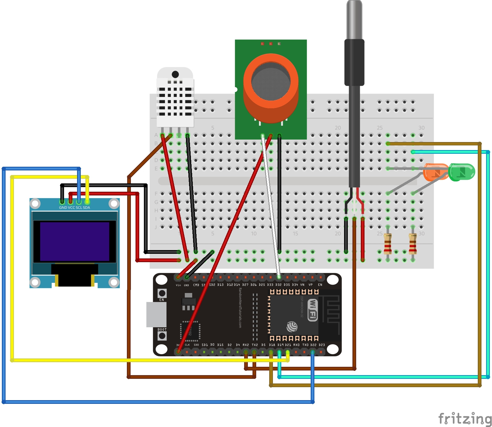
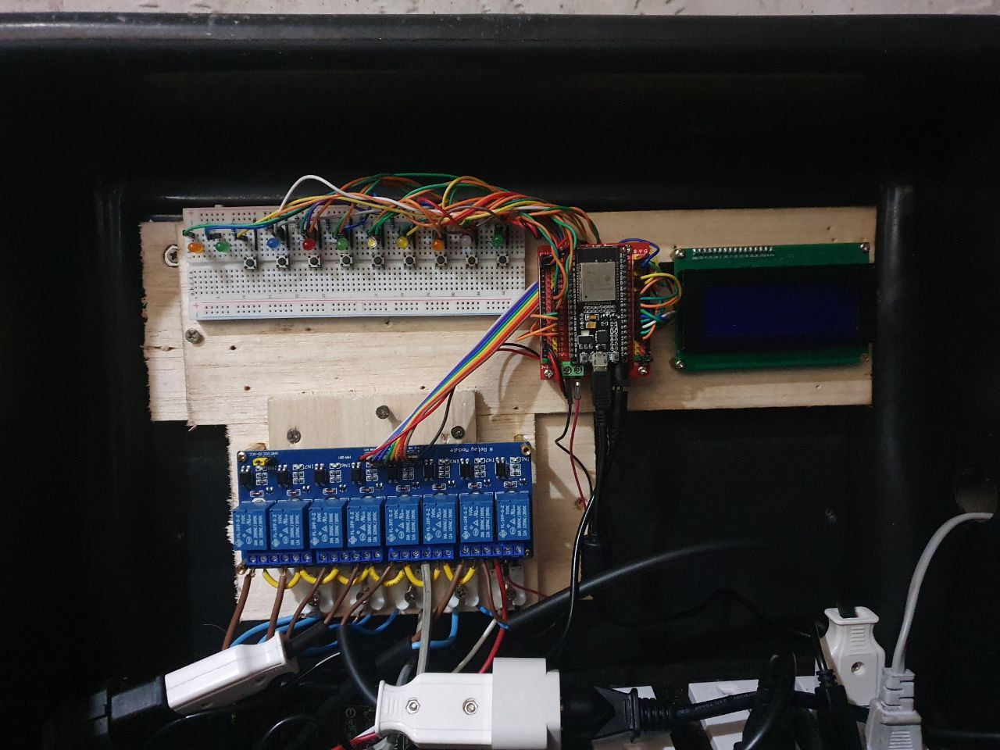
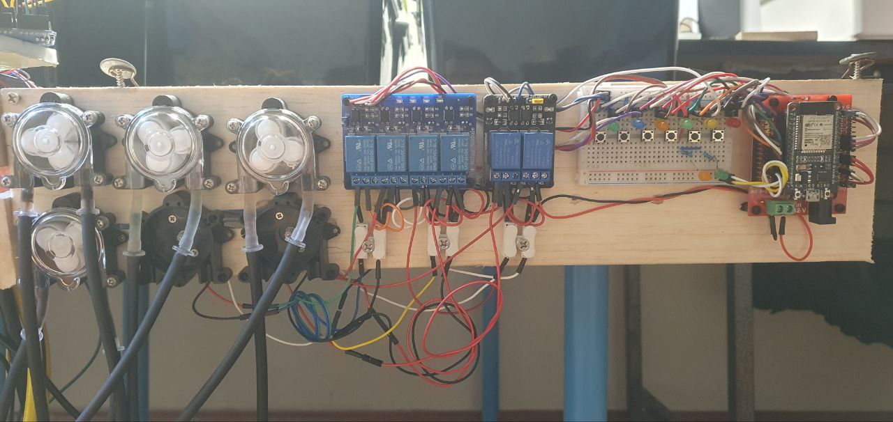
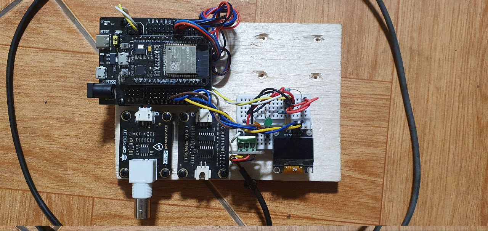
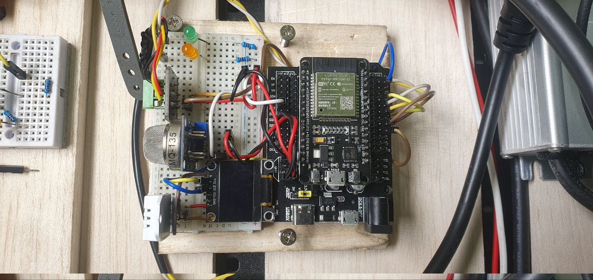

# Arduino Grow System

Automated grow system arduino ide sketches

## Main controller sketch
```
// Network credentials
const char* ssid = "wifi-ssid";
const char* password = "wifi-password";

// MQTT Broker:
const char *mqtt_server = "mqtt-server-address";
const char *mqtt_username = "mqtt-username";
const char *mqtt_password = "mqtt-password";

// System ID
String roomID = "your-system-id";

#include "mainController.h"
```

## Doser sketch
```
// Network credentials
const char* ssid = "wifi-ssid";
const char* password = "wifi-password";

// MQTT Broker:
const char *mqtt_server = "mqtt-server-address";
const char *mqtt_username = "mqtt-username";
const char *mqtt_password = "mqtt-password";

// System ID
String roomID = "your-system-id";

// Component ID
String componentID = "(doser-one|doser-two)";

#include "doser.h"
```

## Water tester sketch
```
// Network credentials
const char* ssid = "wifi-ssid";
const char* password = "wifi-password";

// MQTT Broker:
const char *mqtt_server = "mqtt-server-address";
const char *mqtt_username = "mqtt-username";
const char *mqtt_password = "mqtt-password";

// System ID
String roomID = "your-system-id";

#include "waterTester.h"
```

## Air sensors sketch
```
// Network credentials
const char* ssid = "wifi-ssid";
const char* password = "wifi-password";

// MQTT Broker:
const char *mqtt_server = "mqtt-server-address";
const char *mqtt_username = "mqtt-username";
const char *mqtt_password = "mqtt-password";

// System ID
String roomID = "your-system-id";

#include "airSensors.h"
```

## Services
```
// Restart component
mosquitto_pub -t "{systemID}/(air-sensors|main-controller|water-tester|doser-one|doser-two)-restart" -m "1" -u "user" -P "pass"

// Component screen backlight on/off
mosquitto_pub -t "{systemID}/(air-sensors|main-controller|water-tester)-display-backlight" -m "1|0" -u "user" -P "pass"

// Night mode on/off (turns on/off notification led lights)
mosquitto_pub -t "{systemID}/(air-sensors|main-controller|water-tester|doser-one)-night-mode" -m "1|0" -u "user" -P "pass"

// Device network status
mosquitto_sub -t "device-status/{systemID}-(air-sensors|main-controller|water-tester|doser-one|doser-two)" -u "user" -P "pass"

// Update display interval
mosquitto_pub -t "{systemID}/{main-controller|water-tester|air-sensors}-display-update-interval" -m "{value}" -u "user" -P "pass"

// Calibrate mq-135 sensor
mosquitto_pub -t "{systemID}/air-sensors/calibrate-mq135" -m "1" -u "user" -P "pass"

// Calibrate sgp30 sensor
mosquitto_pub -t "{systemID}/air-sensors/calibrate-sgp30" -m "1" -u "user" -P "pass"

// Main controller relay channel 1
mosquitto_pub -t "{systemID}/water-valve" -m "{1|0}" -u "user" -P "pass"

// Main controller relay channel 2
mosquitto_pub -t "{systemID}/drain-pump" -m "{1|0}" -u "user" -P "pass"

// Main controller relay channel 3
mosquitto_pub -t "{systemID}/mixing-pump" -m "{1|0}" -u "user" -P "pass"

// Main controller relay channel 4
mosquitto_pub -t "{systemID}/extractor" -m "{1|0}" -u "user" -P "pass"

// Main controller relay channel 5
mosquitto_pub -t "{systemID}/lights" -m "{1|0}" -u "user" -P "pass"

// Main controller relay channel 6
mosquitto_pub -t "{systemID}/feeding-pump" -m "{1|0}" -u "user" -P "pass"

// Main controller relay channel 7
mosquitto_pub -t "{systemID}/fan" -m "{1|0}" -u "user" -P "pass"

// Main controller relay channel 8
mosquitto_pub -t "{systemID}/airco" -m "{1|0}" -u "user" -P "pass"

// Doser pump on
mosquitto_pub -t "{systemID}/(doser-one|doser-two)/(p-one|p-two|p-three|p-four|p-five|p-six)" -m "{value}" -u "user" -P "pass"

// Calibrate dosing pumps
mosquitto_pub -t "{systemID}/(doser-one|doser-two)/(p-one|p-two|p-three|p-four|p-five|p-six)-calibrate" -m "{value}" -u "user" -P "pass"
```

### Upload firmware

https://{ipaddress}/update

### Web serial

https://{ipaddress}/webserial

| Component | Command  | Explanation |
| ------------- | ------------- | ------------- |
| air sensor | RESTART | *restart component* |
| air sensor | CALIBRATESGP30 | *calibrate co2 sensor* |
| air sensor | CALIBRATEMQ135 | *calibrate co2 sensor* |
| air sensor | NIGHTMODE:(1|0) | *turn on/off night mode* |
| air sensor | OLEDON:(1|0) | *turn on/off oled display* |
| air sensor | UPDATEINTERVAL:{value} | *update sensors interval* |
| main controller | RESTART | *restart component* |
| water tester | RESTART | *restart component* |
| doser one | RESTART | *restart component* |


## Components list

### Main controller

- 10 led 5mm (2 green, 2 orange, 1 white, 1 light green, 1 light blue, 1 blue, 1 red, 1 yellow)
- 10 resistors (330 ohm more or less)
- breadboard
- 9 push buttons
- 8 channels relay module
- lcd with i2c module
- jumper wires
- esp32 chip ( 38 pins)
- esp shield board
- 5v power adapter

### Doser

- 8 led 5mm (2 green, 2 orange, 1 light green, 1 blue, 1 red, 1 yellow)
- 4 channel relay module
- 2 channel relay module
- jumper wires
- esp32 chip ( 38 pins)
- esp shield board
- 6 push buttons
- half breadboard
- 6 dosing pumps
- 8 resistors (330 ohm more or less)
- 12v power adapter (minimum 1 ohm)

### Water tester

- 2 leds (1 green, 1 orange)
- 2 resistors (330 ohm more or less)
- quarter breadboard
- oled display 128x64
- esp32 chip ( 30 pins)
- esp shield board
- jumper wires
- dfrobot ph sensor v2
- dfrobot tds sensor (max 1000ppm)
- DS18B20 sensor
- DS18B20 board
- 5v power adapter

### Air sensors

- 2 leds (1 green, 1 orange)
- 2 resistors (330 ohm more or less)
- oled display 128x64
- esp32 chip ( 30 pins)
- esp shield board
- half breadboard
- jumper wires
- dht22 sensor
- ds18b20 sensor
- ds18b20 board
- mq-135 sensor
- 5v power adapter

## Schematics

### Main controller


### Doser



### Water tester



### Air sensors



## Final Parts Example

### Main controller



### Doser



### Water tester



### Air sensors

